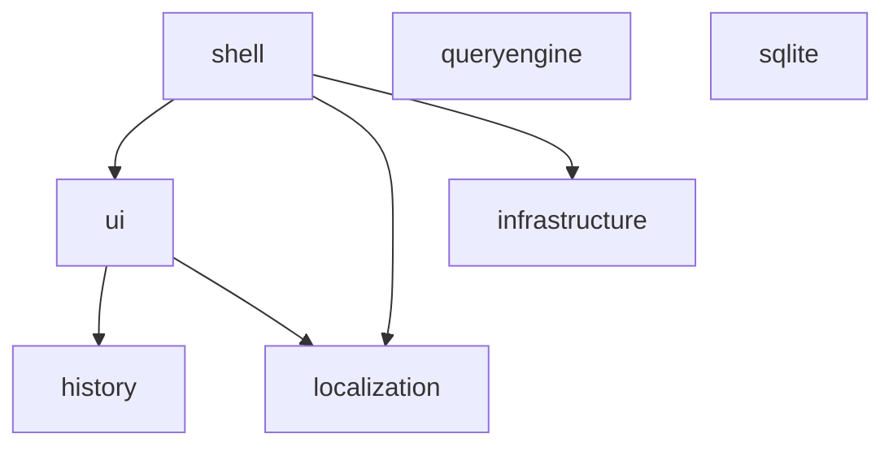

# Architecture

How the `starter` packages are layered, and the decisions that produced the
current shape.

## The dependency graph

Measured from the workspace manifests, not from intent:

| Package                  | Depends on                             | Depended on by |
| ------------------------ | -------------------------------------- | -------------- |
| `starter-shell`          | `ui`, `localization`, `infrastructure` | —              |
| `starter-ui`             | `history`, `localization`              | `shell`        |
| `starter-history`        | —                                      | `ui`           |
| `starter-infrastructure` | —                                      | `shell`        |
| `starter-localization`   | —                                      | `ui`, `shell`  |
| `starter-queryengine`    | —                                      | —              |
| `starter-sqlite`         | —                                      | —              |

The graph is acyclic and has no backward arrows. Five of the seven packages have
no workspace dependencies at all.

## Decision: `starter-core` became `starter-shell` (roadmap 1.5)

### The problem was the name, not the direction

Roadmap step 1.5 was written on the assumption that `core` depending on `ui` was
a layering inversion. Measuring it showed otherwise: nothing imports `core`, so
there is no cycle and no consumer is forced to take a shell in order to get
primitives. `starter-ui` in particular has no dependency on it.

What the package actually contained was an application shell — config and
sitemap validation, route guards, the responsive shell with its navigation, and
the layout presets. A shell assembled from primitives depends on those
primitives. That direction is correct. It only read as backwards because the
package was called `core`, a name that claims the bottom of the stack while the
code sat at the top.

The coupling was never the issue either. `core` reached into `starter-ui` for
the icon registry, mobile drawer, and page-content width contracts across ten
import sites, plus one `declare module` augmentation of the icon registry.

### Options considered

- **(a) Rename `core` to `shell` and keep the dependency.** Chosen.
- **(b) Move the shell into `ui` so `core` becomes dependency-free.** Rejected:
  it makes `ui` a 560-symbol package that is simultaneously a primitive library
  and an app framework, which is a worse version of the problem being solved. It
  would also force every `ui` consumer to resolve `react-router` and
  `virtual:pwa-register/react`.
- **(c) Keep the name and document the exception.** Rejected: the exception
  would have to be restated in every consumer's head forever, and nothing about
  the code justified it.

Renaming was cheap precisely because it happened before the first release
(roadmap 1.7). After publishing, the same change would have cost a deprecated
package, a migration guide and a permanent changelog scar.

### What moved

`offline/` was the one genuinely foundational area inside the old `core`:
twenty exports, zero runtime dependencies, no relationship to a shell. It now
lives in `starter-sqlite` as the `./offline` entry point, next to
`offlineSyncCommandSqlite` and `hydrationEntityStateSqlite`, which already
implemented the persistence half of the same feature.

No symbol was renamed, removed or changed. `@vireocodedev/starter-core` becomes
`@vireocodedev/starter-shell`, and `@vireocodedev/starter-core/offline` becomes
`@vireocodedev/starter-sqlite/offline`.

## The rule this leaves behind

A package's name is a claim about where it sits in the graph. `shell` sits on
top and may depend on anything below it. `ui` sits in the middle. `history`,
`infrastructure`, `localization`, `queryengine` and `sqlite` are leaves and are
expected to stay that way.

Two consequences are enforced mechanically by
[`scripts/public-surface.mjs`](../scripts/public-surface.mjs):

- Every declared entry point's export list is frozen against
  `packages/<pkg>/api-surface.json`, so a layering change cannot land silently.
- The worker-safe entry points — `starter-sqlite` (`.` and `./offline`) and
  `starter-ui/api` — must stay free of React, MUI and other framework code,
  because the consuming app evaluates them inside a Web Worker.

All frontend packages other than `starter-ui` are now being migrated to the
stricter [non-React package authoring contract](./package-authoring/NON_REACT_PACKAGES.md).
That contract excludes React from both runtime code and public declarations;
reusable React presentation belongs in `starter-ui`. `starter-history` is the
first pilot, after which the same audit is applied package by package.

## Known imperfection

`starter-ui` depends on `starter-history` and `starter-localization`, so it is
not a pure primitive layer either. Both dependencies are small and point
downward, so the graph stays acyclic, but a consumer that wants only components
still inherits them. This is recorded rather than fixed.
